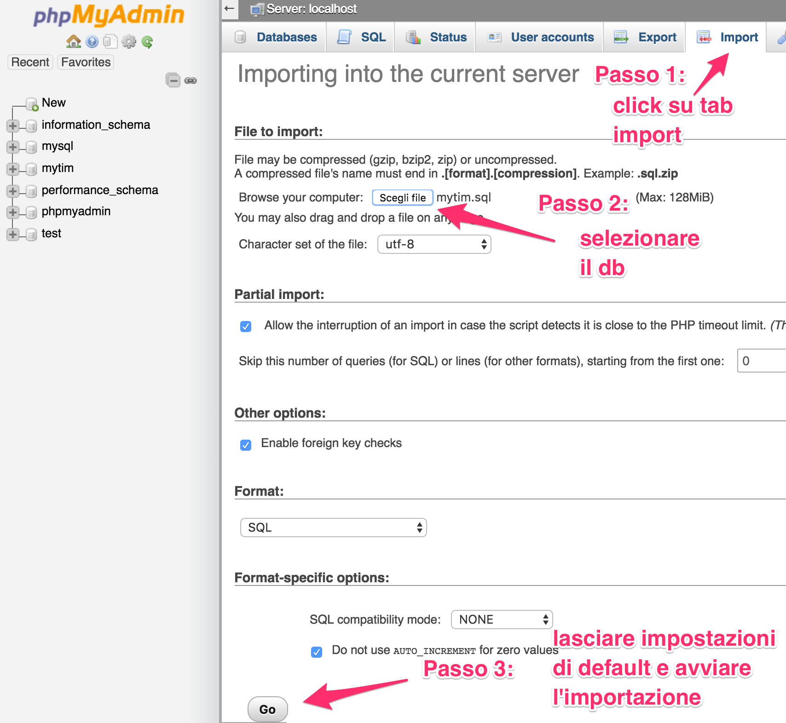

# GUIDA PER SETTARE IL DB

 - installare [XAMPP](https://www.apachefriends.org/it/index.html)

 - avviare il server e il database dal manager
 

 - andare all'indirizzo [http://localhost/phpmyadmin](http://localhost/phpmyadmin)

 - importare il db [mytim.sql](https://github.com/ild0tt0re/HYP_2015-16/blob/master/DB/mytim.sql) lasciando tutto di default

NB:
- Prima di importarlo, creare un database vuoto con lo stesso nome di quello da importare.
- Successivamente creare due nuovi utenti con lo stesso nome 3110366 ma con host name diversi: 
     - uno con "localhost" e l'altro con "%"(any host) 
