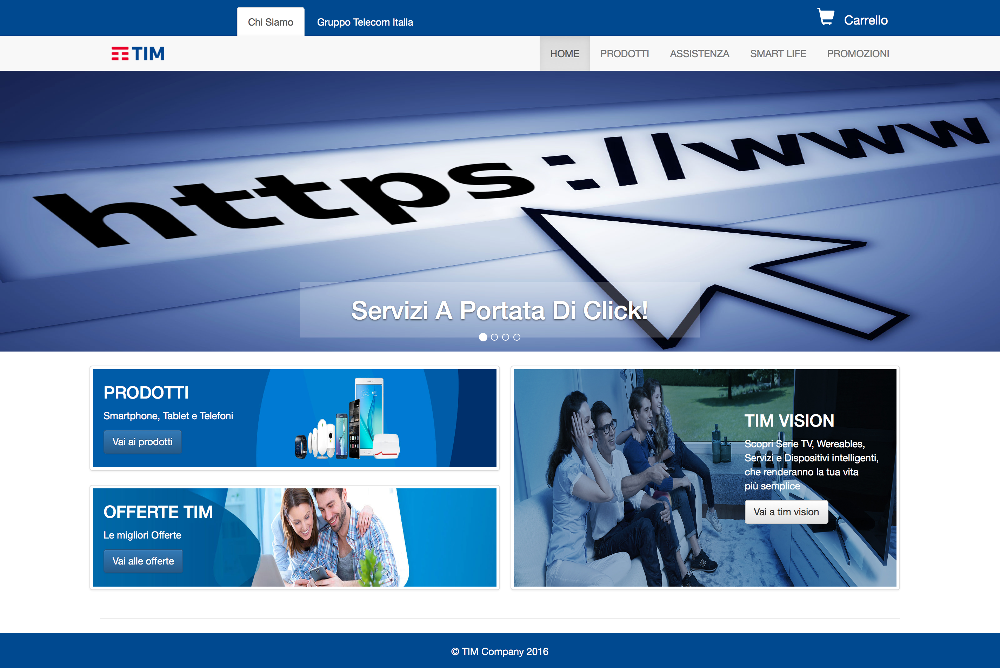

# Progetto di Hypermedia Applications (Web and Multimedia) <br>Parte 2: Documento di Design

### Membri del Gruppo:
 NOME | MATRICOLA | EMAIL
:----| ---------:|------:
Abate Salvatore | 797577 | salvatore.abate@mail.polimi.it
Annunziata Angelo | 853643 | angelo.annunziata@mail.polimi.it




### Data di consegna: 01/07/2016
###Breve descrizione del progetto:

Per l'implementazione tecnologica sono state utilizzate le seguenti tecnologie

Lato Client:
```
- HTML5
    - HTML5 boilerplate
- CSS3
    - SASS preprocessor
- JavaScript
    - jQuery
```


Lato Server:
```
- APACHE
- MYSQL
- PHP
- AJAX
```

